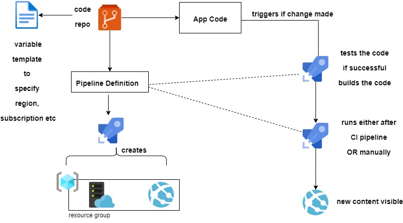

1. Import Json files to Release Pipeline
2. YAML is for classic
3. checkout under each job for getting specific code for that Job - [Docs](https://learn.microsoft.com/en-us/azure/devops/pipelines/repos/multi-repo-checkout?view=azure-devops)
```yml
 resources:
  repositories:
  - repository: MyGitHubRepo
    type: github
    endpoint: MyGitHubServiceConnection
    name: MyGitHubOrgOrUser/MyGitHubRepo
    ref: features/tools
jobs:
- job: A
  steps:
  - checkout: MyGitHubRepo
```


find above [here](./Python-Calculator/)
